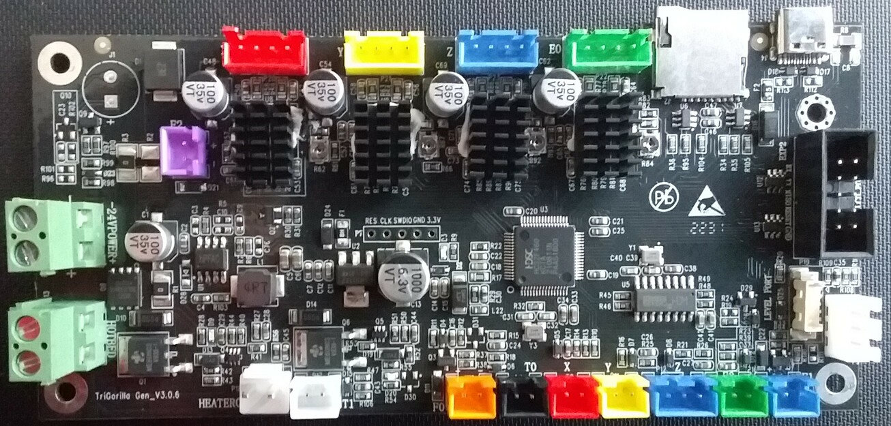
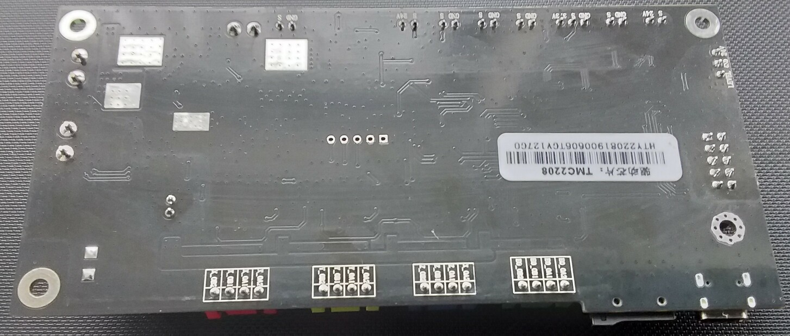
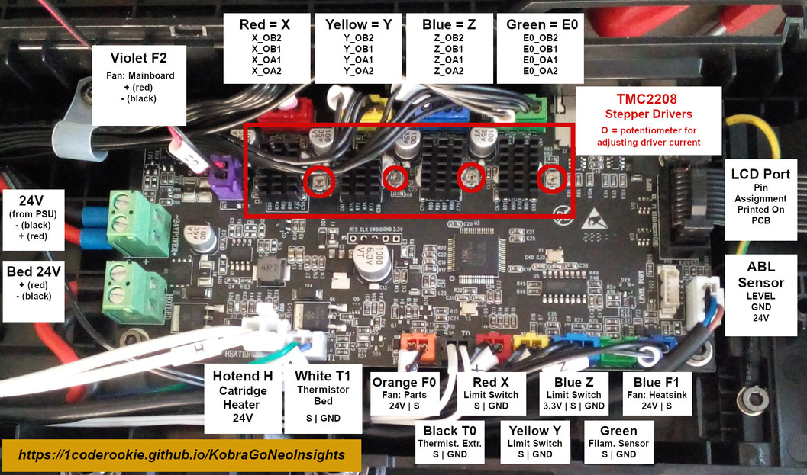
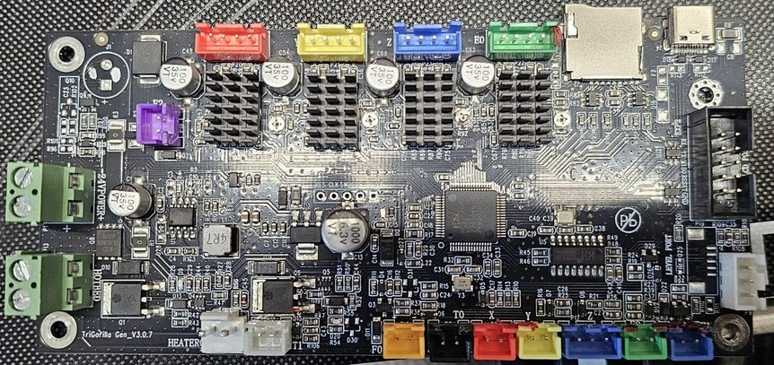
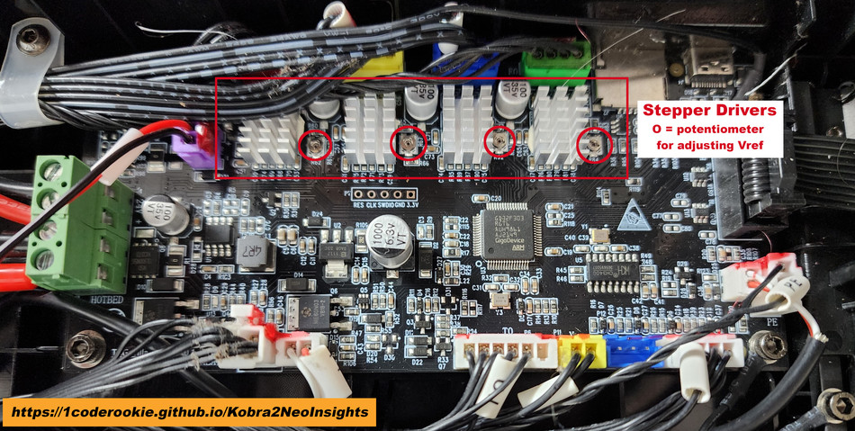

<link rel=”manifest” href=”docs/manifest.webmanifest”>

  

---  

# Type "Gen"

---

## Overview  

---

### Mainboards And Respective Printer Models 

The following table gives an overview about the printer models where the specific mainboards have been used.  
If there's an Insights page I created about the specific model, I linked to it.   

| Board Label | Version | Printer |
|:-----------:|:-------:|:-------:|
| Trigorilla Gen | V3.0.6   V3.0.7 | [Kobra Go](https://1coderookie.github.io/KobraGoNeoInsights/hardware/mainboard/#trigorilla-v_306-stock)   [Kobra Neo](https://1coderookie.github.io/KobraGoNeoInsights/hardware/mainboard/#trigorilla-v_306-stock) |
| Trigorilla Gen | V4.0.1 | [Kobra 2 Neo](https://1coderookie.github.io/Kobra2NeoInsights/hardware/mainboard/#trigorilla-v_401-stock) | 

---

### Hardware

The following table gives an overview about the imho most important-to-know hardware specs.  

- All mainboards run on 24V DC and have the stepper drivers soldered right onto the PCB.  
- None of the mainboards has a fuse that could be changed in case of damage due to high voltage.  
- PWM is being achieved by switching GND 

| Board Label | Version | MCU | Stepper Drivers | mSD | USB | WiFi | 
|:-----------:|:-------:|:---:|:---------------:|:---:|:---:|:----:|
| Trigorilla Gen | V3.0.6   V3.0.7 |  HC32F460 | TMC2208   GC6609 | Yes | Yes | No |
| Trigorilla Gen | V4.0.1 | GD32F303 | TMC2208   GC6609 |  Yes | Yes | No |

---

### Firmware

The following table gives an overview about the firmware the boards are running as well as alternative firmware compatibility.  

| Board Label | Version | Stock Firmware | Stock FW Mods | Klipper |
|:-----------:|:-------:|:--------------:|:-------:|:-------------:|
| Trigorilla Gen | V3.0.6   V3.0.7 | Marlin | [Yes](https://1coderookie.github.io/KobraGoNeoInsights/firmware/fw_marlin/#mods) | [Yes](https://github.com/1coderookie/Klipper4KobraGoNeo) - w/o mod |
| Trigorilla Gen | V4.0.1 | Marlin | [Yes](https://1coderookie.github.io/Kobra2NeoInsights/firmware/fw_marlin/#mods) | [Yes](https://github.com/1coderookie/Klipper4Kobra2series/tree/main/Kobra2Neo) - w/o mod |  

---

## Gen V_3.0.6 
  
It is a 32bit 24V mainboard with a Huada HC32F460 KCTA ARM Cortex-M4 with 192KB SRAM and 512KB Flash.  
The speed  of the ARM chip is listed as 200MHz by the manufacturer.  
It offers a microSD card reader, a USB-C connector and a 10 pin connector for adding the control unit.    
The mainboard comes with TMC2208 silent stepper drivers *soldered* onto the board (so they can't be just swapped out!). 

??? info "GC6609 stepper drivers being used as well!"  

    It seems that Anycubic changed the stepper drivers from original TMC2208 to cheap 2208/2209 clones, called "GC6609".  
    When exactly this change took place and whether it's a permanent solution or if only a certain batch of these mainboards have been populated with these kind of stepper drivers is unknown. It seems though that the mainboards which are equipped with these drivers are set up with silver heatsinks instead of black heatsinks.    
    However, the following picture shows this stepper driver (you'd have to take off the heatsink to identify which specific type was being used at your mainboard - which I wouldn't recommend to do if you're just curious to know which one you have..).    
    
      
    
        

  
  
  
    

---

## Gen V_3.0.7  

A TriGorilla V_3.0.7 has been spotted in a [Kobra Go](). is being used. Besides a missing connector it's not clear what has been changed compared to the V_3.0.6 board - it seems that the MCU and pin assignments are the same though.   

  

---

## Gen V_4.0.1 
  
It's a 32bit 24V mainboard with a GigaDevice MCU labeled as "GD32F303" which seems to be an ARM Cortex-M4 with 120MHz, 1024k Flash and 96k RAM.   

It offers a microSD card reader, a USB-C connector and a 10 pin connector for adding the control unit.    
The mainboard comes with TMC2208 silent stepper drivers *soldered* onto the board (so they can't be just swapped out!). 

??? info "GC6609 stepper drivers being used as well!"  

    It seems that Anycubic changed the stepper drivers from original TMC2208 to cheap 2208/2209 clones, called "GC6609".  
    When exactly this change took place and whether it's a permanent solution or if only a certain batch of these mainboards have been populated with these kind of stepper drivers is unknown. It seems though that the mainboards which are equipped with these drivers are set up with silver heatsinkns instead of black heatsinks.    
    However, the following picture shows this stepper driver (you'd have to take off the heatsink to identify which specific type was being used at your mainboard - which I wouldn't recommend to do if you're just curious to know which one you have..).    
    
      
    
    
  
  
  
<!--
    

--> 

---

  
 
