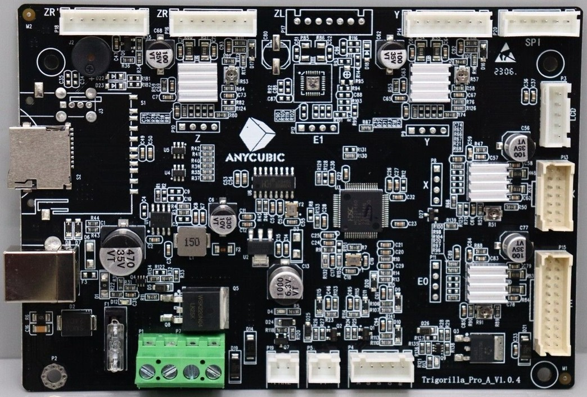
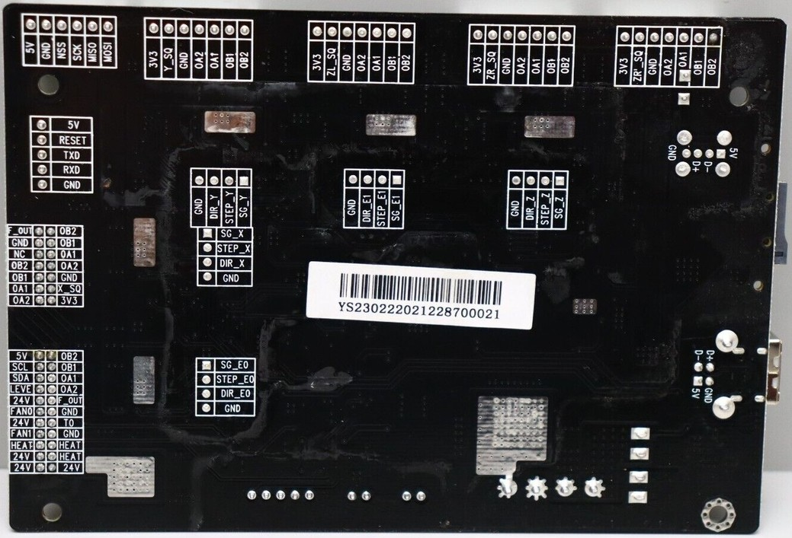
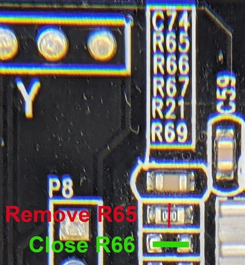
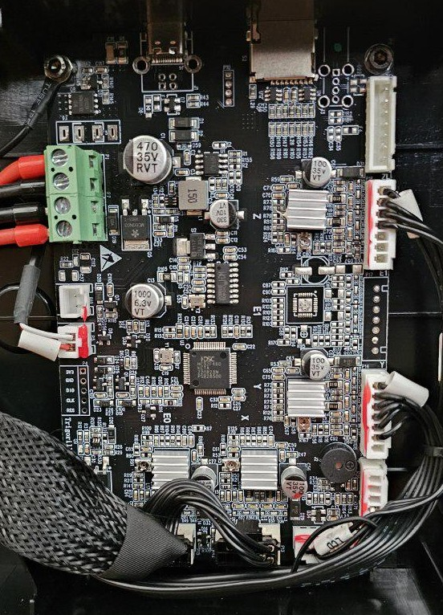
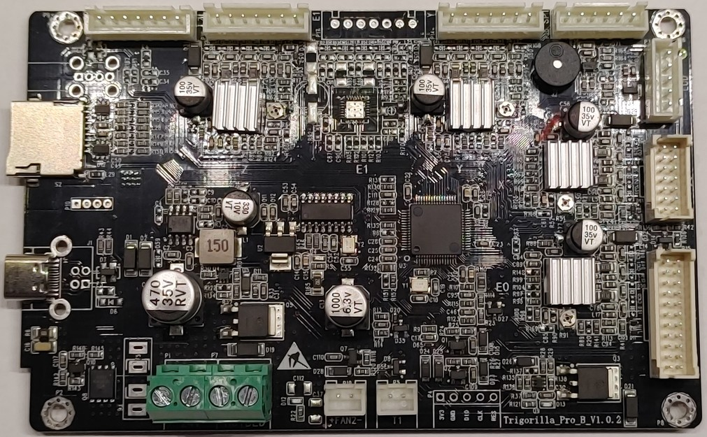
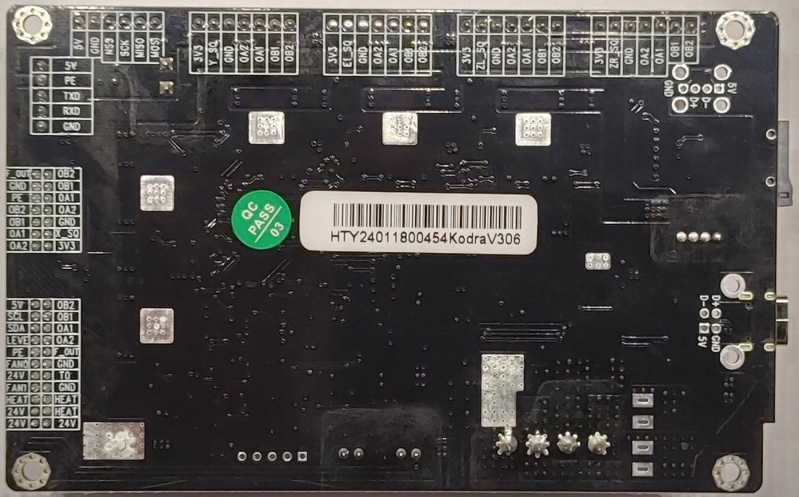
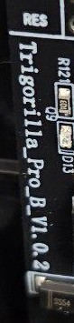
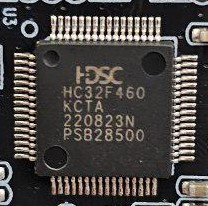

<link rel=”manifest” href=”docs/manifest.webmanifest”>

  

---  

# Type "Pro"

---

## Overview  

---

### Mainboards And Respective Printer Models 

The following table gives an overview about the printer models where the specific mainboards have been used.  
If there's an Insights page I created about the specific model, I linked to it.   

| Board Label | Version | Printer |
|:-----------:|:-------:|:-------:|
| Trigorilla Pro A | V1.0.4 | Kobra   Kobra Plus   Kobra Max   Vyper | 
| Trigorilla Pro B | V1.0.2 | [Kobra 2](https://1coderookie.github.io/Kobra2Insights/hardware/mainboard/#trigorilla-pro-b-v_102-stock)   Later revs. of:   Kobra   Kobra Plus   Kobra Max | 

---

### Hardware

The following table gives an overview about the imho most important-to-know hardware specs.  

- All mainboards run on 24V DC and have the stepper drivers soldered right onto the PCB.  
- None of the mainboards has a fuse that could be changed in case of damage due to high voltage.  
- PWM is being achieved by switching GND 

| Board Label | Version | MCU | Stepper Drivers | mSD | USB | WiFi | 
|:-----------:|:-------:|:---:|:---------------:|:---:|:---:|:----:|
| Trigorilla Pro A | V1.0.4 | HC32F460 | TMC2208   GC6609 |  Yes | Yes | No |
| Trigorilla Pro B | V1.0.2 | HC32F460 | TMC2208   GC6609 |  Yes | Yes | No |

---

### Firmware

The following table gives an overview about the firmware the boards are running as well as alternative firmware compatibility.  

| Board Label | Version | Stock Firmware | Stock FW Mods | Klipper |
|:-----------:|:-------:|:--------------:|:-------:|:-------------:|
| Trigorilla Pro A | V1.0.4 | Marlin | unknown | Yes - *with mod*:   [Solder R65 to R66](type_pro.md#important-notes-on-klipper) *or* use [catboat](https://github.com/printers-for-people/catboat)! |
| Trigorilla Pro B | V1.0.2 | Marlin | unknown | Yes - w/o mod   [Kobra 2](https://github.com/1coderookie/Klipper4Kobra2series/tree/main/Kobra2)   add Kobras... |

---

## Pro A V1.0.4

It is a 32bit 24V mainboard with a Huada HC32F460 KCTA ARM Cortex-M4 with 192KB SRAM and 512KB Flash.  
The speed  of the ARM chip is listed as 200MHz by the manufacturer.  
The mainboard comes with TMC2208 silent stepper drivers *soldered* onto the board (so they can't be just swapped out!).   

  

  

---

### MOD: Replacing With Pro B

If needed, the Pro A v1.0.4 can be replaced with the younger Pro B v1.0.2, the connectors and wiring of the parts do fit.  
Then install Klipper with the according `printer.cfg` for the Pro B, mind the settings and make sure that they fit your printer (e.g. check on the bed size).  

---

### Important Notes On Klipper

Due to a (imho) faulty PCB design and therefore certain TMC driver issues, we can't just run the stock Pro A board with a native Klipper.   
We have two options here we *have* to choose from:  
- proceed a little hardware mod or  
- run a special version of Klipper.  

Now, the first option is to grab a solder iron and replace the resistor R65 to the location of R66.  
R65 is labeled as "000", which means it has zero resistance and is basically just a 'bridge' to close the circuit there. So you can either unsolder it and then solder it to R66, or you carefull chip R65 away and close the contact at R66 with a small piece of wire you solder across them (or solder only).  
The following picture shows the location of R65 and R66.  

  

*Make sure to not harm any other parts and don't create any short circuits!*     

The second option is to use a special fork of Klipper: ["catboat"](https://github.com/printers-for-people/catboat).  
Catboat addresses and solves the issue on a software side, so you *don't have to solder*.  
You can find `printer.cfg` files for all the printer models where this mainboard was being used [here](https://github.com/printers-for-people/catboat/tree/main/config) - please make sure to use the correct one.  

---

## Pro B V1.0.2 
  
It is a 32bit 24V mainboard with a Huada HC32F460 KCTA ARM Cortex-M4 with 192KB SRAM and 512KB Flash.  
The speed  of the ARM chip is listed as 200MHz by the manufacturer.  
It offers a microSD card reader, a USB-C connector and a 10 pin connector for adding the control unit.    
The mainboard comes with TMC2208 silent stepper drivers *soldered* onto the board (so they can't be just swapped out!).   

<!--
??? info "Maybe GC6609 Stepper Drivers Are Being Used As Well!"  

    It seems that Anycubic changed the stepper drivers from original TMC2208 to cheap 2208/2209 clones, called "GC6609".  
    When exactly this change took place and whether it's a permanent solution or if only a certain batch of these mainboards have been populated with these kind of stepper drivers is unknown. It seems though that the mainboards which are equipped with these drivers are set up with silver heatsinkns instead of black heatsinks.    
    However, the following picture shows this stepper driver (you'd have to take off the heatsink to identify which specific type was being used at your mainboard - which I wouldn't recommend to do if you're just curious to know which one you have..).    
    
      
    
    I personally don't know anything about these drivers, but @aspiringnobody shared his knowledge and findings in [this discussion](https://github.com/1coderookie/KobraGoNeoInsights/discussions/13). If you know anything more, please reach out and contribute to the discussion!  
    
    Thanks again to @aspiringnobody who came across this and reported it!  
-->  

<!--  
  
-->

  

  
  
  

  

---

  
 
