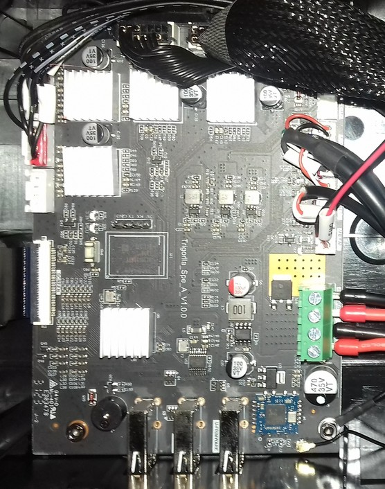
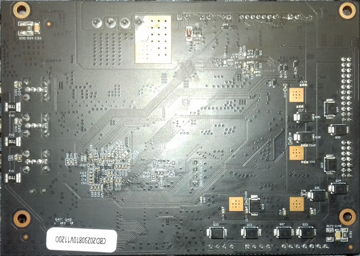
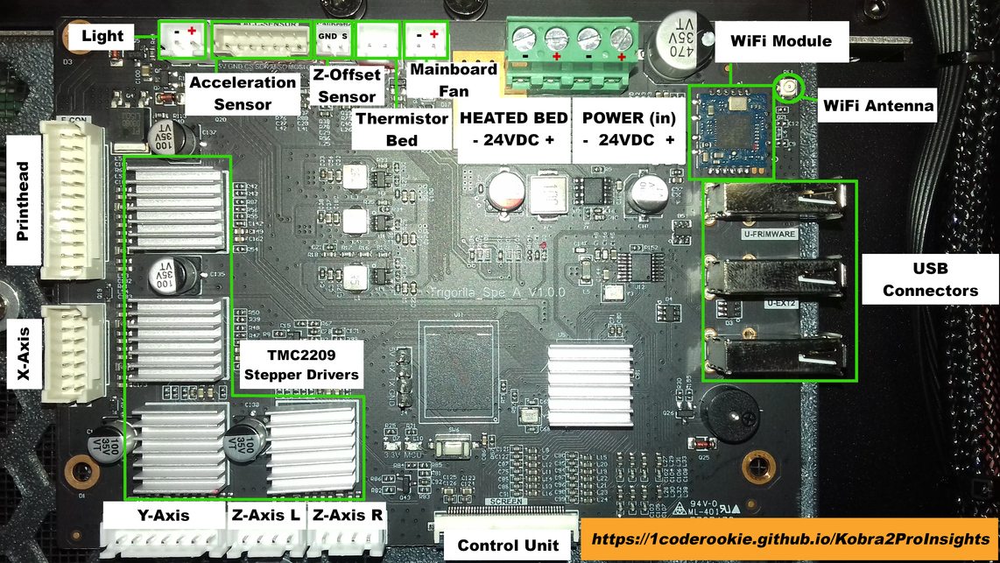
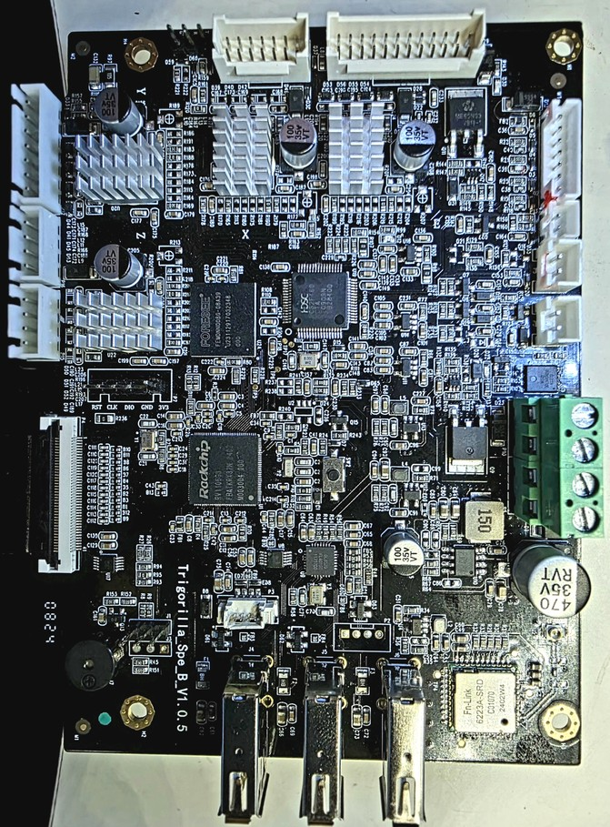
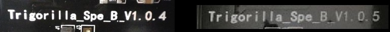
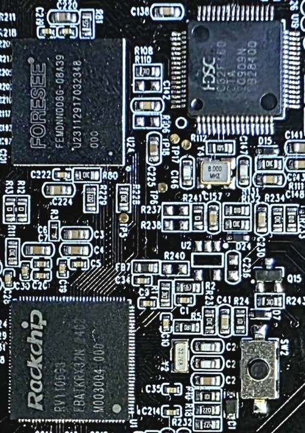

<link rel=”manifest” href=”docs/manifest.webmanifest”>

  

---  

# Type "Spe"  

---

## Overview  

---

### Mainboards And Respective Printer Models 

The following table gives an overview about the printer models where the specific mainboards have been used.  
If there's an Insights page I created about the specific model, I linked to it.   

| Board Label | Version | Printer |
|:-----------:|:-------:|:-------:|
| Trigorilla Spe A | V1.0.0 | [Kobra 2 Pro](https://1coderookie.github.io/Kobra2ProInsights/hardware/mainboard/#trigorilla_spe_a_v100-stock)   [Kobra 2 Plus](https://1coderookie.github.io/Kobra2PlusInsights/hardware/mainboard/#trigorilla_spe_a_v100-stock)   [Kobra 2 Max](https://1coderookie.github.io/Kobra2MaxInsights/hardware/mainboard/#trigorilla_spe_a_v100-stock) | 
| Trigorilla Spe B | V1.0.4   V1.0.5 | [Kobra 2 Pro](https://1coderookie.github.io/Kobra2ProInsights/hardware/mainboard/#trigorilla_spe_b_v10x-stock-new-revision) |
| Trigorilla Spe B | V1.1.3 | Kobra 3 | 

---

### Hardware

The following table gives an overview about the imho most important-to-know hardware specs.  

- All mainboards run on 24V DC and have the stepper drivers soldered right onto the PCB.  
- None of the mainboards has a fuse that could be changed in case of damage due to high voltage.  
- PWM is being achieved by switching GND 

| Board Label | Version | MCU | Stepper Drivers | mSD | USB | WiFi | 
|:-----------:|:-------:|:---:|:---------------:|:---:|:---:|:----:|
 Trigorilla Spe A | V1.0.0 | ARM Cortex-A7 | TMC2209 |  No | Yes (no PC connection) | Yes |
| Trigorilla Spe B | V1.0.4   V1.0.5 | HC32F460 | TMC2209 |  No | Yes (no PC connection) | Yes |
| Trigorilla Spe B | V1.1.3 | HC32F460 | TMC2209 | No | Yes (no PC connection) | Yes |

---

### Firmware

The following table gives an overview about the firmware the boards are running as well as alternative firmware compatibility.  

| Board Label | Version | Stock Firmware | Stock FW Mods | Klipper |
|:-----------:|:-------:|:--------------:|:-------:|:-------------:|
| Trigorilla Spe A | V1.0.0 | KobraOS | No | No |
| Trigorilla Spe B | V1.0.4   V1.0.5 | KobraOS | Yes: [Rinkhals](https://github.com/jbatonnet/Rinkhals) | unknown | 
| Trigorilla Spe B | V1.1.3 |KobraOS | Yes: [Rinkhals](https://github.com/jbatonnet/Rinkhals) | unknown | 

---

<!--
# Mainboard

It has to be noticed that Anycubic apparently changed the mainboard revisions at a certain point after the Kobra 2 Pro/Plus/Max (which all used to have the same type of mainboard built in) hit the market.  
In the 'beginning', these printers were equipped with the "Trigorilla **Spe A**_v1.0.0". This mainboard was designed to run the newly developed [KobraOS]() firmware (which isn't Marlin anymore, but Anycubic's own firmware based on Klipper; see the chapter "Firmware" for further information).     
Probably around summer 2024, printers with "Trigorilla **Spe B**_v1.0.x" mainboards were sold - it's unclear if this only happened with a few smaller batches or if this change was permanent since then. These mainboards are equipped with a HC32F460 chip, just like other Trigorilla mainboards before that were running Marlin firmware and which could have been flashed with Klipper.  
Also, afaik, the Kobra 3 uses the "Trigorilla **Spe B**_v1.1.x., which might be a later revision of the Spe_B-revision used in the Kobra 2 Pro/Plus/Max at a certain point. The Kobra 3 also runs KobraOS, but a different version than the one that has been used at the Kobra 2 Pro/Plus/Max printers before.  
The important thing now is that there is a modded KobraOS of the Kobra 3 available, which not only seems to work fine with the B-revision of the mentioned mainboard, but it also offers access and enhanced functionality.  
Unfortunately, I personally don't have such a mainboard and therefore I can't test it, but imho it might even be possible now to install a native Klipper on this B-revision mainboards.  
So if you're looking for a solution to run a different type of firmware (either a modded KobraOS or a native Klipper), please mind the following infobox.  

!!! warning "Mind the Board Type"  

    If you're not satisfied with the stock KobraOS and seek for other options, check which mainboard revision you have built in:  
    - If it's the "Spe **A**" type, then you'd have to build in a different mainboard and go with a native Klipper (see the according chapter further down below).  
    - If it's the "Spe **B**" type, then you might want to try the modded KobraOS (see the chapter "Firmware" for further information) before attempting a hardware mod.  

--->

## Trigorilla_Spe_A_V1.0.0 
  
The "Trigorilla_Spe_**A**_V1.0.0" is a 32bit 24V mainboard with an ARM Cortex-A7 which runs at 1.2GHz and offers 8GB of internal storage capacity.  

The mainboard comes with four TMC2209 silent stepper drivers (at least that's what Anycubic states - I didn't take off the heatsinks to check if these really are genuine TMC2209 chips) which are *soldered* onto the board (they can't be swapped out!).  

It offers three USB-A connectors labeled at the PCB as "U-EXT1", "U-EXT2" and "U-FRIMWARE" (yes, typo included ;) ).  

It also offers a built in Realtek WiFi chip ([RTL8723DU](https://www.realtek.com/en/products/communications-network-ics/item/rtl8723du)) with an external antenna which is glued to the left front side of the black plastic aperture from the inside of the housing (the position is about where the label "Kobra 2 Pro" is located).   

  
  
  

At the following picture I added labels of the connectors.  

The pinout of the 7 pin connector of the acceleration sensor is printed onto the PCB itself (same with some other pinouts of connectors in that row), but I'll list it here again, just in case you can't read it on your mainboard and when zooming in the picture shown above.  
So when you're looking at the connector in the direction of the picture above, the pinout (from left to right) is:  
| 5V | GND | CS | SCK | MISO | MOSI | GND |  

---

## Trigorilla_Spe_B_V1.0.x (Stock, new revision) 
  
The "Trigorilla_Spe_**B**_V1.0.x" is a 32bit 24V mainboard with a Huada HC32F460 chip.  
Two revisions of this mainboard have been spotted in a Kobra 2 Pro, the "Spe_B_v1.0.4" and the "Spe_B_v1.0.5".  
The following picture shows the "Trigorilla Spe_B_v1.0.5".  

  

  
   

The mainboard comes with four TMC2209 silent stepper drivers (at least that's what Anycubic states - I didn't take off the heatsinks to check if these really are genuine TMC2209 chips) which are *soldered* onto the board (they can't be swapped out!).  
It offers three USB-A connectors and WiFi.     

!!! info "Modified KobraOS Available"  

    For *this* type of mainboard there's a modded KobraOS version available: ["Rinkhals"](https://github.com/jbatonnet/Rinkhals)

---

  
